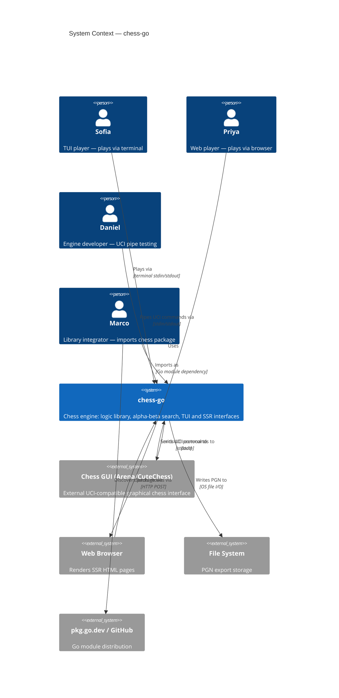
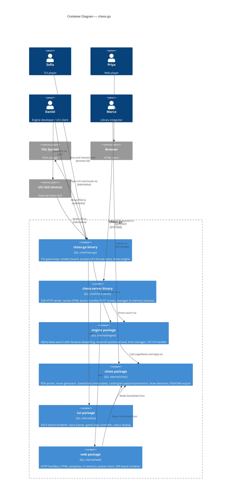
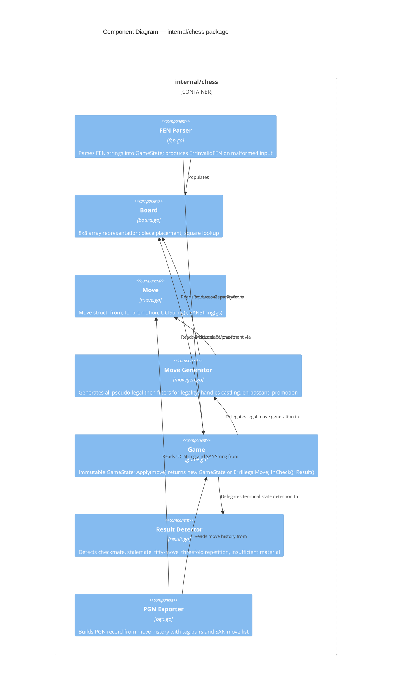
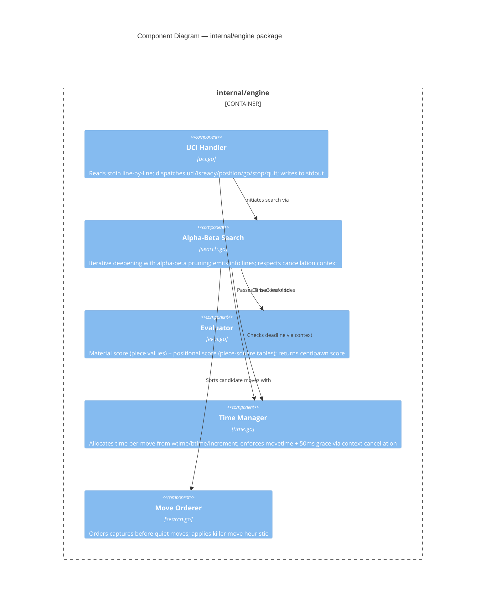

# Architecture Design — Chess Engine in Go
**Epic**: chess-engine | **Date**: 2026-02-21 | **Status**: Approved
**Architect**: Morgan (nw-solution-architect)

---

## 1. System Context

### Business Capabilities

The system delivers three layered capabilities:
1. **Chess Logic Library** — a zero-dependency Go package for rules, move generation, and game state
2. **Search Engine** — an alpha-beta engine with UCI protocol compliance
3. **Player Interfaces** — a TUI binary and an SSR HTTP server, both consuming the two packages above

### Personas and External Systems

| Persona | Entry Point | Primary Concern |
|---------|------------|----------------|
| Marco (library integrator) | `go get`, pkg.go.dev | Clean API, zero deps, immutable state |
| Sofia (TUI player) | `$ chess-go` binary | Play a game, see results |
| Daniel (engine developer) | UCI pipe (stdin/stdout) | Protocol compliance, NPS, benchmarking |
| Priya (web player) | `http://localhost:8080` | Click-to-move, no installation |

### External System Interactions

| External System | Protocol | Direction |
|----------------|----------|-----------|
| Chess GUIs (Arena, Cute Chess) | UCI over stdin/stdout | Bidirectional |
| Browser (Priya's client) | HTTP GET/POST | Bidirectional |
| File system | OS file I/O | Write (PGN export) |
| Standard terminal | ANSI/ASCII | Write (board render) |

---

## 2. C4 — System Context Diagram (L1)



---

## 3. C4 — Container Diagram (L2)



---

## 4. C4 — Component Diagram: chess package (L3)

The chess package has 7+ internal components and warrants a Component diagram.



---

## 5. C4 — Component Diagram: engine package (L3)



---

## 6. Architecture Pattern: Layered Modular Monolith with Ports-and-Adapters

### Decision

Strict one-direction dependency graph with no cycles:

```
chess package  ←  engine package  ←  tui/web packages  ←  cmd binaries
(zero deps)        (depends on chess)   (depends on both)    (entry points)
```

This is a **modular monolith with dependency inversion**. Each layer exposes an interface contract (port); the layer below implements it. The chess package is a pure domain model; it has no framework dependency.

### Why Not Microservices

- Team size: solo/small (< 10 people) — coordination overhead of microservices would dominate
- Independent deployment: not a requirement for v1 (both binaries are standalone)
- Conway's Law: single team, single codebase; splitting services would create artificial boundaries
- Rejected: microservices, event-driven architecture (no distributed deployment required)
- Rejected: separate chess HTTP API service (adds network hop with no benefit for local tool)

### Quality Attribute Priorities (from requirements)

| Attribute | Priority | Driver |
|-----------|----------|--------|
| Correctness | Critical | Perft validation, typed errors, immutable state |
| Testability | High | chess package 90%+ coverage, perft suite |
| Performance | High | 100k+ NPS, 200ms SSR response |
| Maintainability | High | Clean package boundaries, zero-dep core |
| Operability | Medium | Single binary deployment, no config file |
| Portability | High | Linux/macOS/Windows, standard library |

---

## 7. Dependency Rule (Ports and Adapters)

All dependencies point inward toward the chess package. No inner package imports an outer package.

```
                     ┌─────────────────┐
                     │   chess package │  ← domain model (innermost ring)
                     │   (zero deps)   │
                     └────────┬────────┘
                              │ imported by
                     ┌────────▼────────┐
                     │  engine package │  ← application layer
                     │  (deps: chess)  │
                     └────────┬────────┘
                              │ imported by
              ┌───────────────┴──────────────┐
              │                              │
     ┌────────▼────────┐           ┌─────────▼──────────┐
     │   tui package   │           │    web package     │  ← adapter layer
     │ (deps: chess,   │           │  (deps: chess,     │
     │  engine)        │           │   engine)          │
     └────────┬────────┘           └─────────┬──────────┘
              │                              │
     ┌────────▼────────┐           ┌─────────▼──────────┐
     │  cmd/chess-go   │           │  cmd/chess-server  │  ← entry points
     └─────────────────┘           └────────────────────┘
```

**Ports** (interfaces the inner layer exposes):
- `chess.GameState` — immutable value produced by `Game.Apply()`
- `chess.Move` — value type with `UCIString()`, `SANString()`
- `engine.SearchResult` — `BestMove Move`, `Score int`, `Depth int`
- `engine.TimeControl` — `MoveTime`, `WTime`, `BTime`, `WInc`, `BInc`

**Adapters** (implementations that satisfy ports):
- `tui.Renderer` — satisfies board display for terminal
- `web.Handler` — satisfies HTTP interface for SSR
- `engine.UCIHandler` — satisfies UCI protocol wire format

---

## 8. Integration Patterns

### TUI Game Loop (synchronous, single goroutine model)

```
Main goroutine: read input → validate → apply → [launch engine goroutine] → render
Engine goroutine: search with context timeout → send result to channel → exit
Main goroutine: select on result channel → apply engine move → render
```

### SSR Request Cycle (synchronous, per-request)

```
POST /game/{id}/move
  → validate move (chess package)
  → apply move → new GameState
  → call engine.Search(gameState, TimeControl{MoveTime: 2000ms})
  → apply engine response → new GameState
  → store session
  → HTTP 302 → GET /game/{id}
  → render HTML template with current GameState
```

Engine is called synchronously within the HTTP request cycle. The 200ms SSR response target is achievable with a 2-second movetime cap and a fast search (100k+ NPS).

### UCI Protocol (goroutine per command stream)

```
Main:      stdin reader goroutine → command channel
Dispatcher: select on command channel → dispatch handler
Search:    launched as goroutine with context; cancelled on stop/quit
Output:    stdout writer (all output serialized, no interleaving)
```

---

## 9. Data Flow for Key Scenarios

### Scenario: Player makes a move in SSR GUI

```
Browser POST /game/{id}/move?from=e2&to=e4
  │
  ▼
web.Handler
  │ ParseMove("e2", "e4") → Move{From: e2, To: e4}
  │ LoadSession(id) → GameState
  │
  ▼
chess.Game.Apply(move)
  │ ErrIllegalMove → HTTP 422
  │ OK → newGameState
  │
  ▼
engine.Search(newGameState, TimeControl)
  │ → SearchResult{BestMove: g8f6}
  │
  ▼
chess.Game.Apply(SearchResult.BestMove)
  │ → finalGameState
  │
  ▼
web.Session.Store(id, finalGameState)
HTTP 302 → GET /game/{id}
  │
  ▼
web.Handler renders html/template with finalGameState
  → 200 OK, full HTML page
```

### Scenario: UCI `go movetime 1000`

```
stdin → "go movetime 1000"
  │
  ▼
engine.UCIHandler.ParseGo() → TimeControl{MoveTime: 1000ms}
  │
  ▼
engine.Search(currentPosition, tc) [goroutine with context deadline]
  │ every completed depth: emit "info depth N score cp N nodes N nps N pv ..."
  │ context cancelled at 1000ms
  │
  ▼
engine.Search returns BestMove (best from last completed depth)
  │
  ▼
stdout → "bestmove g1f3"   [within 50ms of deadline]
```

---

## 10. Deployment Architecture

Both binaries compile to a single static binary per platform (no shared libraries, no runtime dependencies).

```
Build: go build ./cmd/chess-go    → chess-go    (TUI + engine)
Build: go build ./cmd/chess-server → chess-server (SSR + engine)

Runtime dependencies:
  chess-go     : terminal emulator with ANSI support
  chess-server : network port 8080 (configurable)
  Both         : no database, no config file, no internet access
```

### Cross-Platform Compilation

```
GOOS=linux   GOARCH=amd64 go build ./cmd/...
GOOS=darwin  GOARCH=arm64 go build ./cmd/...
GOOS=windows GOARCH=amd64 go build ./cmd/...
```

---

## 11. Quality Attribute Strategies

### Correctness (Critical)
- Perft test suite at depths 1–5 against known values (AC-11)
- Typed errors: `ErrIllegalMove`, `ErrInvalidFEN`, `ErrInvalidMoveFormat` — no panics on bad input
- GameState immutability enforced by returning new struct on every Apply()
- Threefold repetition tracked via Zobrist hash history in Game struct

### Performance (High)
- Move generator: pseudo-legal generation + legality filter (efficient for non-bitboard)
- Alpha-beta with iterative deepening: each iteration refines the best move; time cutoff after completed iteration
- Move ordering: captures scored by MVV-LVA (most valuable victim / least valuable attacker) first; killer moves second
- No heap allocation in hot search path: Move is a value type (not pointer)

### Testability (High)
- chess package: pure functions, no I/O, no global state — all functions testable in isolation
- engine package: Search() accepts GameState and TimeControl; deterministic at fixed seed for testing
- tui/web: thin adapters over chess/engine; tested by behavior (board output, HTTP responses)
- Test coverage target: chess package >= 90% line coverage

### Concurrency Safety (High)
- GameState is immutable: safe to share across goroutines without locks
- Engine search goroutine communicates result via channel; no shared mutable state with main goroutine
- SSR session store: `sync.RWMutex` protecting in-memory map
- UCI handler: search goroutine cancelled via `context.Context`; no goroutine leak on stop/quit

### Portability (High)
- chess package: zero external dependencies, standard library only
- TUI: raw terminal I/O via `os.Stdin`/`os.Stdout` + optional `golang.org/x/term` for raw mode
- SSR: `net/http` from standard library; no frontend framework

---

## 12. File and Package Layout

```
chess_go/
├── cmd/
│   ├── chess-go/
│   │   └── main.go          ← TUI entry point: wires tui + engine
│   └── chess-server/
│       └── main.go          ← SSR entry point: wires web + engine + HTTP listen
│
├── internal/
│   ├── chess/               ← ZERO external dependencies
│   │   ├── board.go         ← Board type (8x8 array), square constants
│   │   ├── move.go          ← Move type, UCIString(), SANString()
│   │   ├── game.go          ← GameState, Apply(), InCheck(), LegalMoves()
│   │   ├── fen.go           ← NewGameFromFEN(), GameState.ToFEN()
│   │   ├── movegen.go       ← Pseudo-legal generation + legality filter
│   │   ├── result.go        ← Result detection: checkmate/stalemate/draws
│   │   └── pgn.go           ← Game.ToPGN(), SAN formatting
│   │
│   ├── engine/              ← depends on: internal/chess
│   │   ├── search.go        ← Alpha-beta with iterative deepening, info emission
│   │   ├── eval.go          ← Material + piece-square table evaluation
│   │   ├── time.go          ← TimeControl struct, allocation logic, deadline
│   │   └── uci.go           ← UCI stdin/stdout protocol handler
│   │
│   ├── tui/                 ← depends on: internal/chess, internal/engine
│   │   ├── renderer.go      ← ASCII board render, status line, move history
│   │   ├── input.go         ← UCI-format move input parser
│   │   └── loop.go          ← Game loop: player turn → engine turn → result check
│   │
│   └── web/                 ← depends on: internal/chess, internal/engine
│       ├── handler.go       ← HTTP handlers: GET /, POST /game/new, GET+POST /game/{id}
│       ├── session.go       ← In-memory session store with sync.RWMutex
│       └── template.go      ← html/template definitions for board and result pages
│
└── go.mod                   ← module: chess_go, go 1.22
```

---

## 13. Walking Skeleton (Feature 0)

The walking skeleton is the minimum slice that validates all layers are connected:

```
Input:    starting FEN (hardcoded)
chess:    NewGameFromFEN → GameState
chess:    GameState.LegalMoves() → []Move (20 moves)
engine:   random selection from []Move → Move (no search logic)
chess:    GameState.Apply(Move) → newGameState
tui:      Renderer.Render(newGameState) → ASCII board to stdout
Exit:     code 0
```

Acceptance: exactly one legal move is applied, board displayed, no panic, exit 0.

---

## 14. Risks and Mitigations

| Risk | Likelihood | Impact | Mitigation |
|------|-----------|--------|-----------|
| Move generator produces wrong perft counts | Medium | High | Build perft test suite (US-12) before implementing engine; perft is the canonical correctness check |
| Engine exceeds time limit | Low | Medium | Time manager uses `context.WithDeadline`; search checks `ctx.Done()` at every node; fallback = best move from previous depth |
| Threefold repetition tracking incorrect | Medium | Medium | Zobrist hashing with position history; unit tests with known repetition sequences |
| SSR session lost on server restart | Low | Low | Documented v1 limitation; in-memory only |
| TUI renders incorrectly on Windows console | Medium | Low | ASCII fallback (no Unicode required); test on Windows CMD |
| Goroutine leak on engine stop | Low | High | `context.Context` cancellation; search goroutine always exits on cancel |
